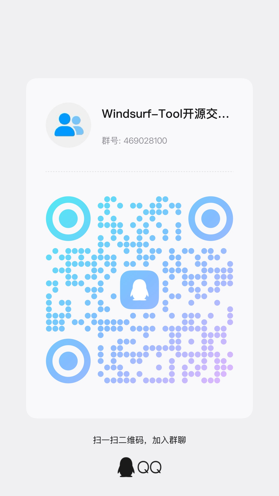

# Windsurf-Tool 1.0

<div align="center">

**Batch Registration, Auto Switch, Account Pool Management**

[](https://opensource.org/licenses/MIT)
[](https://www.electronjs.org/)
[](https://www.apple.com/macos/)

[English](README_EN.md) | [简体中文](README.md)

[Features](#features) • [Quick Start](#quick-start) • [User Guide](#user-guide) • [Build Instructions](#build-instructions) • [How It Works](#how-it-works) • [Windows Adaptation](#windows-adaptation)

</div>

---

## Features

✅ **Batch Auto Registration** - Automatically register Windsurf accounts with custom domain emails  
✅ **Smart Verification Bypass** - Auto bypass Cloudflare verification using puppeteer-real-browser  
✅ **Local Email Reception** - Receive verification codes locally via IMAP protocol, no backend server needed  
✅ **Account Pool Management** - Manage accounts locally (CRUD), with expiration reminders  
✅ **One-Click Account Switch** - Auto reset config, clear machine ID, complete account switching  
✅ **Multi-language Support** - Supports Simplified Chinese and English  

---

## Quick Start

### Requirements

- **Node.js**: v16.0.0 or higher
- **npm**: v7.0.0 or higher
- **OS**: macOS (currently only supports macOS)

### Installation

```bash
# 1. Clone repository
git clone https://github.com/crispvibe/Windsurf-Tool.git
cd Windsurf-Tool

# 2. Install dependencies
npm install

# 3. Start application
npm start

# Development mode (with dev tools)
npm run dev
```

---

## User Guide

### 1. Email Configuration

Go to "Settings" page and configure:

#### Email Domain Configuration
Add your domain email suffix, for example:
- `example.com`
- `yourdomain.com`

Registration will auto-generate emails in format: `user_xxxxx@yourdomain.com`

#### IMAP Email Configuration

Configure IMAP settings for receiving verification codes:

**QQ Mail Example:**
```
IMAP Server: imap.qq.com
Port: 993
Email: your@qq.com
Password: Authorization code (not QQ password)
```

**Gmail Example:**
```
IMAP Server: imap.gmail.com
Port: 993
Email: your@gmail.com
Password: App-specific password
```

Click "Test Connection" to verify configuration.

### 2. Batch Registration

1. Go to "Batch Registration" page
2. Set registration count (recommend 1-10)
3. Click "Start Batch Registration"
4. System automatically completes:
   - Fill basic information (name, email)
   - Set password
   - Bypass Cloudflare verification
   - Receive and input verification code
   - Save account locally

### 3. Account Management

Go to "Account Management" page to:
- View all registered accounts
- View account statistics (total, available, expiring soon, expired)
- View each account's Pro status and remaining days
- Copy account info or delete accounts
- Manually add existing accounts

**Expiration Rules:**
- Pro trial period: 13 days
- Remaining days > 3: Green badge
- Remaining days ≤ 3: Orange badge (warning)
- Expired: Red badge

### 4. Switch Account (Fully Automatic)

1. Go to "Switch Account" page
2. Select account from dropdown
3. Click "Auto Switch Account"
4. System automatically:
   - Fully reset Windsurf config and machine ID
   - Auto launch Windsurf app
   - Auto fill login info using Puppeteer
   - Complete account switch

---

## Build Instructions

### macOS Build

#### Method 1: Using Build Script (Recommended)

```bash
# Run interactive build script
chmod +x build.sh
./build.sh

# Select build option:
# 1) macOS (DMG + ZIP)
# 2) Windows (NSIS)
# 3) Linux (AppImage + DEB)
# 4) All platforms
```

#### Method 2: Using npm Commands

```bash
# Build macOS version (x64 + arm64)
npm run build:mac

# Build arm64 only (Apple Silicon)
npm run build:mac-arm64

# Build all platforms
npm run build
```

#### Build Output

After building, files are in `dist/` directory:

```
dist/
├── Windsurf-Tool 1.0-1.0.0-arm64.dmg    # Apple Silicon installer
├── Windsurf-Tool 1.0-1.0.0-x64.dmg      # Intel installer
├── Windsurf-Tool 1.0-1.0.0-arm64-mac.zip
└── Windsurf-Tool 1.0-1.0.0-x64-mac.zip
```

#### Installation

1. Open `.dmg` file
2. Drag `Windsurf-Tool 1.0` to `Applications` folder
3. First run: Right-click app and select "Open" (bypass Gatekeeper)

### Windows Build

**Note: Current version is not fully adapted for Windows, build is for testing only.**

```bash
# Cross-compile Windows version on macOS or Linux
npm run build:win
```

Build output:
```
dist/
└── Windsurf-Tool 1.0 Setup 1.0.0.exe
```

---

## How It Works

### Core Tech Stack

- **Frontend Framework**: Electron 27.1.0
- **Browser Automation**: puppeteer-real-browser (bypass Cloudflare)
- **Email Reception**: Node.js IMAP (local implementation)
- **System Automation**: AppleScript (macOS)
- **Data Storage**: JSON files (local storage)

### Key Technical Implementations

#### 1. Cloudflare Verification Bypass

Using `puppeteer-real-browser` library's turnstile feature:
```javascript
const { connect } = require('puppeteer-real-browser');
const { page } = await connect({
  turnstile: true,  // Auto handle Cloudflare Turnstile
  headless: false
});
```

#### 2. Local IMAP Email Reception

Implement IMAP protocol in Electron main process:
```javascript
const Imap = require('imap');
const { simpleParser } = require('mailparser');

// Connect to IMAP server
const imap = new Imap({
  host: config.host,
  port: config.port,
  tls: true,
  user: config.user,
  password: config.password
});

// Search and parse verification code emails
```

#### 3. Complete Reset Mechanism

When switching accounts, perform:

**Delete config and cache:**
```bash
rm -rf ~/Library/Application Support/Windsurf
rm -rf ~/Library/Caches/Windsurf
```

**Reset machine identifiers:**
- `machineId` - Machine unique identifier
- `sqmId` - Telemetry identifier
- `devDeviceId` - Device identifier
- `machineid` file - Hardware fingerprint

#### 4. Auto Login Process

Using AppleScript to simulate keyboard input:
```applescript
tell application "System Events"
  keystroke "email@example.com"
  delay 0.5
  keystroke tab
  keystroke "password"
  delay 0.5
  keystroke return
end tell
```

#### 5. Account Expiration Management

- Record creation time on registration
- Pro trial period fixed at 13 days
- Real-time calculation of remaining days
- Display different status badges based on remaining days

### Data Storage Structure

**accounts.json** - Account data
```json
[
  {
    "id": "1234567890",
    "email": "user_xxxxx@example.com",
    "password": "user_xxxxx@example.com",
    "createdAt": "2024-01-01T00:00:00.000Z"
  }
]
```

**current_login.json** - Current logged-in account
```json
{
  "email": "user_xxxxx@example.com",
  "password": "user_xxxxx@example.com"
}
```

---

## Windows Adaptation

### Current Status

⚠️ **This tool currently only fully supports macOS. Windows version requires the following adaptation work.**

### Features Requiring Adaptation

#### 1. Config Paths

**macOS paths:**
```javascript
const WINDSURF_CONFIG = path.join(process.env.HOME, 'Library/Application Support/Windsurf');
const WINDSURF_CACHE = path.join(process.env.HOME, 'Library/Caches/Windsurf');
```

**Windows paths:**
```javascript
const WINDSURF_CONFIG = path.join(process.env.APPDATA, 'Windsurf');
const WINDSURF_CACHE = path.join(process.env.LOCALAPPDATA, 'Windsurf');
```

#### 2. Cleanup Commands

**macOS command:**
```javascript
await execPromise(`rm -rf "${WINDSURF_CONFIG}"`);
```

**Windows command:**
```javascript
await execPromise(`rmdir /s /q "${WINDSURF_CONFIG}"`);
// Or use Node.js fs module
await fs.rm(WINDSURF_CONFIG, { recursive: true, force: true });
```

#### 3. Launch Application

**macOS command:**
```javascript
await execPromise('open -a Windsurf');
```

**Windows command:**
```javascript
await execPromise('start "" "C:\\Program Files\\Windsurf\\Windsurf.exe"');
```

#### 4. Automation Scripts

**macOS uses AppleScript:**
```applescript
tell application "System Events"
  keystroke "text"
end tell
```

**Windows needs to use:**
- **PowerShell** - Send keystrokes
- **AutoHotkey** - Automation scripts
- **robotjs** - Node.js keyboard simulation (already in dependencies)

Example code (using robotjs):
```javascript
const robot = require('robotjs');
robot.typeString('email@example.com');
robot.keyTap('tab');
robot.typeString('password');
robot.keyTap('enter');
```

### Adaptation Steps

1. **Detect OS**
```javascript
const isWindows = process.platform === 'win32';
const isMac = process.platform === 'darwin';
```

2. **Modify `main.js`**
   - Add platform detection
   - Choose different config paths based on platform

3. **Modify `src/windsurfManager.js`**
   - Adapt Windows cleanup commands
   - Adapt Windows launch commands
   - Use robotjs instead of AppleScript

4. **Modify `package.json`**
   - Ensure robotjs dependency is correctly installed
   - Configure Windows build options

5. **Testing**
   - Test all features in Windows environment
   - Verify paths, commands, automation work correctly

### Example Code Snippets

**Platform detection and path selection:**
```javascript
function getWindsurfPaths() {
  if (process.platform === 'darwin') {
    return {
      config: path.join(process.env.HOME, 'Library/Application Support/Windsurf'),
      cache: path.join(process.env.HOME, 'Library/Caches/Windsurf')
    };
  } else if (process.platform === 'win32') {
    return {
      config: path.join(process.env.APPDATA, 'Windsurf'),
      cache: path.join(process.env.LOCALAPPDATA, 'Windsurf')
    };
  }
}
```

**Cross-platform cleanup:**
```javascript
async function clearWindsurf() {
  const paths = getWindsurfPaths();
  
  for (const dir of Object.values(paths)) {
    try {
      await fs.rm(dir, { recursive: true, force: true });
    } catch (error) {
      console.error(`Cleanup failed: ${dir}`, error);
    }
  }
}
```

**Cross-platform app launch:**
```javascript
async function launchWindsurf() {
  if (process.platform === 'darwin') {
    await execPromise('open -a Windsurf');
  } else if (process.platform === 'win32') {
    // Adjust based on actual installation path
    const windsurfPath = 'C:\\Program Files\\Windsurf\\Windsurf.exe';
    await execPromise(`start "" "${windsurfPath}"`);
  }
}
```

---

## Important Notes

⚠️ **Important:**

1. **Data Backup** - Switching accounts will clear all Windsurf config, backup important data first
2. **IMAP Password** - Usually authorization code, not email login password
3. **Domain Email** - Ensure configured domain email can receive Windsurf verification emails
4. **Batch Registration** - Recommend 5-10 seconds interval to avoid detection
5. **System Permissions** - macOS requires accessibility permissions (System Preferences > Security & Privacy > Accessibility)

---

## FAQ

**Q: Cloudflare verification failed?**  
A: puppeteer-real-browser handles it automatically, check network connection if failed.

**Q: Not receiving verification codes?**  
A: Check IMAP config is correct, use "Test Connection" to verify.

**Q: Where is account data stored?**  
A: Stored in `accounts.json` file in app data directory.

**Q: How to backup accounts?**  
A: Copy `accounts.json` file from app data directory.

**Q: Auto login failed?**  
A: 
1. Ensure Windsurf is fully launched and showing login screen
2. Check if system allows AppleScript control (System Preferences > Security & Privacy > Accessibility)
3. If auto login fails, account credentials will be displayed for manual input

---

## Developer Info

This tool runs completely locally, no backend server required.  
All data stored locally, protecting privacy and security.

### Project Structure

```
windsurf-tool/
├── main.js                      # Electron main process
├── renderer.js                  # Renderer process logic
├── index.html                   # Main interface
├── language-selector.html       # Language selection interface
├── build.sh                     # Build script
├── src/
│   ├── browserAutomation.js     # Puppeteer browser automation
│   ├── clickLogin.applescript   # AppleScript automation script
│   ├── emailReceiver.js         # IMAP email reception
│   ├── i18n.js                  # Internationalization support
│   ├── registrationBot.js       # Batch registration bot
│   └── windsurfManager.js       # Windsurf manager
├── package.json                 # Project config
└── .gitignore                   # Git ignore file
```

### Tech Stack

- **Electron** - Cross-platform desktop app framework
- **Puppeteer** - Browser automation
- **Node.js IMAP** - Email reception
- **AppleScript** - macOS system automation

---

## License

This project is licensed under [MIT License](LICENSE).

---

## Community

### QQ Group

Welcome to join QQ group for discussion:

<div align="center">
  
  <p>Scan to join QQ group</p>
</div>

---

## Contributing

Welcome to submit Issues and Pull Requests!

If you want to contribute to Windows adaptation, please refer to [Windows Adaptation](#windows-adaptation) section.

---

<div align="center">

**Made with ❤️ for Windsurf Users**

</div>
